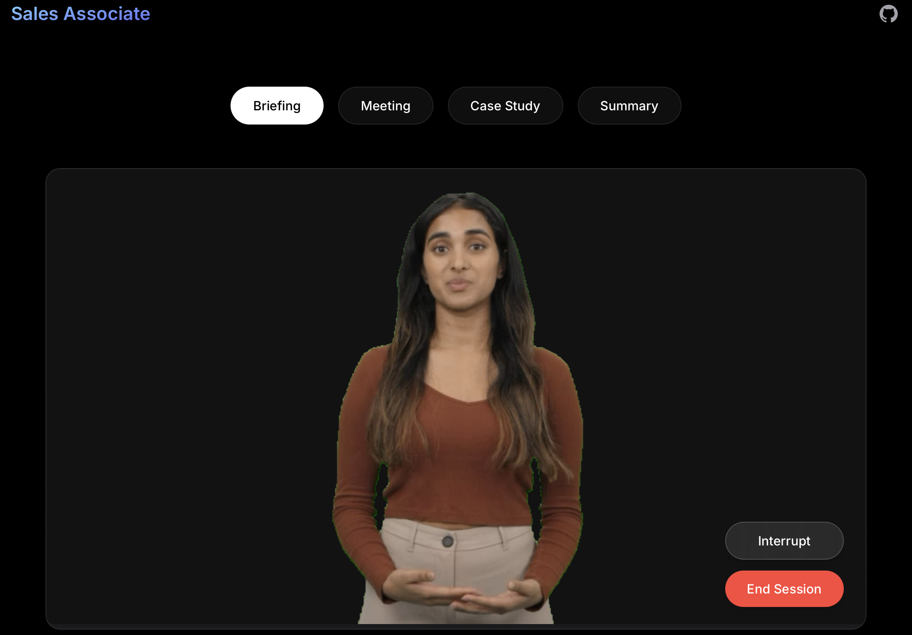

# Sales Associate Interactive Avatar Demo



This project is a fork of the [HeyGen Interactive Avatar NextJS Demo](https://github.com/HeyGen-Official/StreamingAvatarSDK). Please follow their setup instructions first to get the base Interactive Avatar functionality working.

## What This Demo Does

This demo implements an AI Sales Associate powered by HeyGen's Interactive Avatar technology. The avatar assists Account Executives (AEs) by:

1. **Pre-Meeting Briefing**: Automatically pulls and summarizes prospect information from your CRM (currently supports HubSpot) including:
   - Company details (size, industry, revenue)
   - Contact's role and background
   - Previous interactions and engagement history
   - Current opportunities and deal stages

2. **Meeting Support**: During sales conversations, the avatar can:
   - Answer questions about relevant case studies and customer success stories
   - Provide real-time product information
   - Take notes and identify key discussion points

3. **Post-Meeting Follow-up**: Automatically:
   - Logs meeting summaries back to the CRM
   - Identifies next steps and action items

## Setup

1. Follow the base setup instructions from the original HeyGen Interactive Avatar demo first
2. Add your HubSpot access token to the `.env` file:
   ```
   HUBSPOT_ACCESS_TOKEN=your_token_here
   ```

## Using the Demo

1. Start a new session with the avatar
2. Enter the prospect's email address to pull their information from HubSpot
3. The avatar will provide a briefing based on the CRM data
4. During the meeting, interact with the avatar using either text or voice
5. When finished, the avatar will automatically sync the meeting summary back to HubSpot

Note: This demo uses fallback data if HubSpot integration fails or if the contact isn't found in your CRM.
